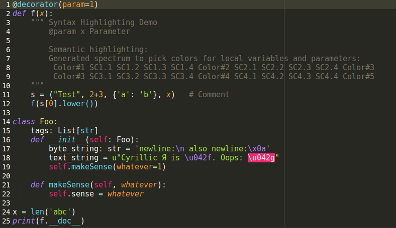

## 用original最好看

### How to Use
26.02.12 更新

点击顶部菜单 File (文件)。
选择 Manage IDE Settings (管理 IDE 设置)。
选择 Import Settings... (导入设置)。
选择你的 .jar 文件。
在弹出的对话框中，勾选你想要导入的部分（例如 Color Schemes），然后点击 OK 并重启。

---

- download `.jar` or `.icls` from the directory of specific monokai theme folder
- PyCharm -> File -> Settings -> Editor -> Color Scheme -> Import Scheme -> Select jar/icls file

### Pycharm-2017.3/2018.2

author: [simoncos](https://github.com/simoncos)

- [python-sublime-monokai](python-sublime-monokai)

- [python-boxy-monokai](python-boxy-monokai)

### Original Version

author: [spasserby](https://github.com/spasserby)

- Note: it's been found that Pycharm-2017.3 on Ubuntu 16.04 cannot get correct color maps from [original version](original)
- PyCharm version : 5.0.4

